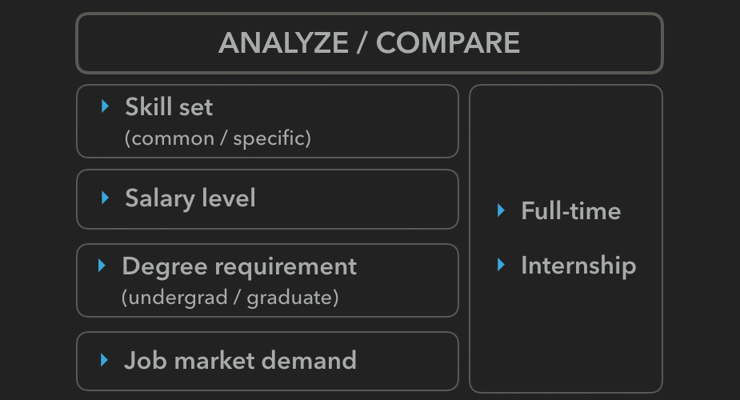
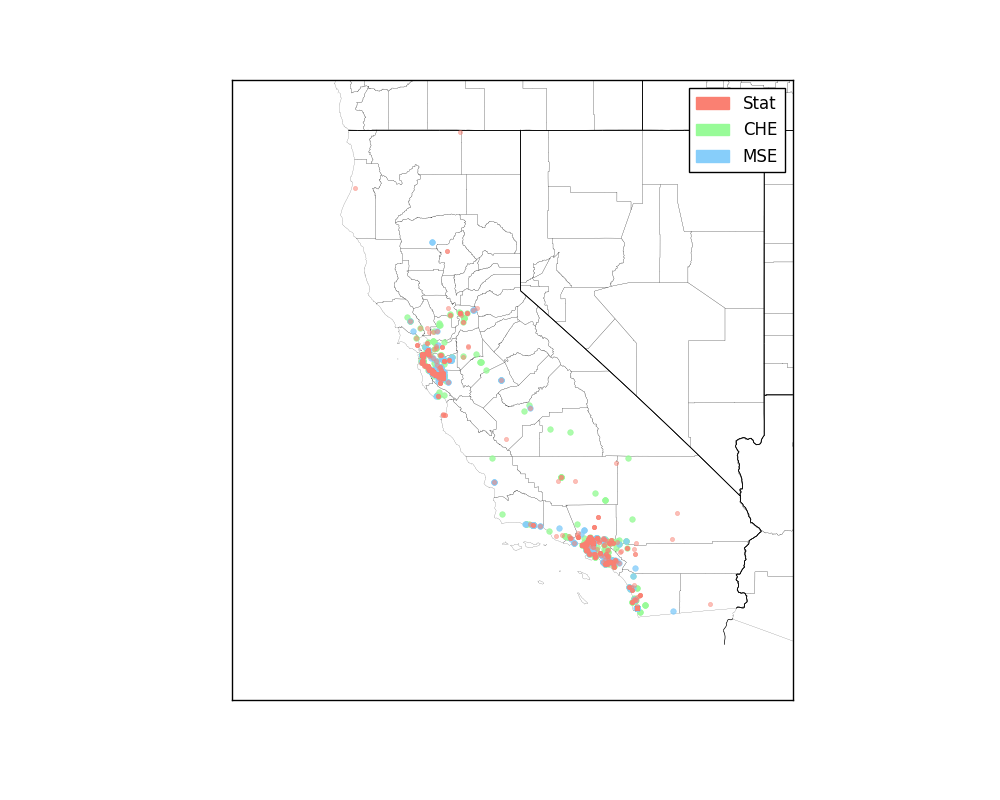
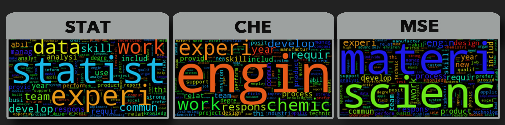
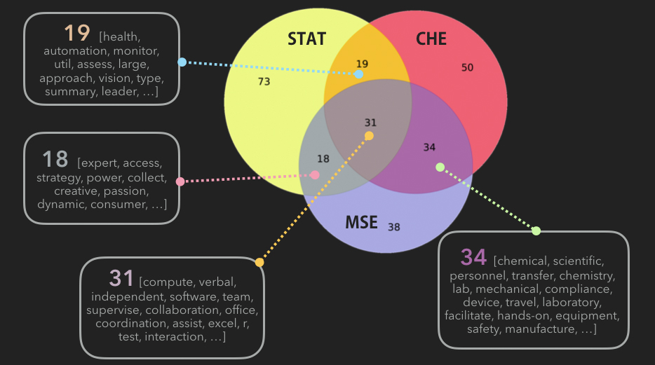
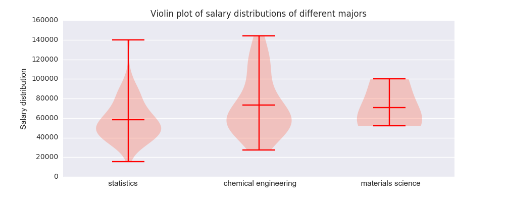

<html>
  <head>
    <meta charset="utf-8">
    <meta http-equiv="X-UA-Compatible" content="chrome=1">
    <title> Recent Job Market Analysis across Differnet Majors </title>
    <link rel="stylesheet" href="{{ '/assets/css/style.css?v=' | append: site.github.build_revision | relative_url }}">
    
    
    <!--[if lt IE 9]>
      
    <![endif]-->
    <!--[if lt IE 8]>
    <link rel="stylesheet" href="{{ '/assets/css/ie.css' | relative_url }}">
    <![endif]-->
    <meta name="viewport" content="width=device-width, initial-scale=1, user-scalable=no">

  </head>
  <body>

    

      <section>
        

          <h1> Recent Job Market Analysis </h1>
          

          
 <a href="mailto:cjwchen@ucdavis.edu?Subject=Hello%20again" target="_top">Jiewei Chen</a> and
          <a href="mailto:xdxue@ucdavis.edu?Subject=Hello%20again" target="_top">Da Xue</a> 

          

         

<h2> 
A quick look at this project
 </h2>

	<iframe width="560" height="315" src="https://www.youtube.com/embed/vwKmp3zmiXg" frameborder="0" allowfullscreen></iframe>

  

 

		What is the current demand in the job market? How much money can I make if I major in statistics? What are the most important skills to put into my resume? Where are the hiring companies located? How does the job market differ across different majors? When is the job market largest?… 

 	These practical questions are faced by new graduates and even younger college students. This project tries its best to help the freshmen to choose the best major; senior and graduate students to draw a big picture of the current job market. 

 	The majority of this project analyzes and compares the job market for the 3 majors of STAT, CHE, and MSE. (Because we are CHE and MSE students considering of pursuing a second degree!) 

<h2> METHOD & TECHENIQUES </h2>

		The data of the job market come from indeed.com(link). We restricted our scope to STAT, CHE, and MSE, and California. (The procedure can be easily extended to other locations and majors.) 

		To quickly get to the fun part of the results, the methodologies and techniques we used for this project are summarized in this table. You may scroll down to the very bottom to find the link to our jupyter notebook to find more details. 

	

<h2>  INTERSTING FINDINGS  </h2>

	<h3>1. Where are the hiring companies ?</h3>
	

  	
  	

	
 Not surprisingly, there are two clusters on the map, one is at the silicon valley, and the other is around LA. 

	
 Another interesting observation is that the STAT companies are more closely centered at these two locations, whereas the CHE and MSE companies are more widely distributed.

	
	Check out these interactive maps to have a closer look at the job posts. Click the pins to find the job titles and company names! 

	
	<iframe width="215" height="180" src='Figures/Statistics.html' frameborder="1"></iframe><iframe width="215" height="180" src='Figures/Chemical_Engineering.html' frameborder="1"></iframe><iframe width="215" height="180" src='Figures/Materials_Science.html' frameborder="1"></iframe>

 

	<h3> 2. Grads vs Undergrads, who are more wanted? </h3>
	

		
	

	
 

	
The majority of the jobs only require a Bachelors degree. For internships, the percentage of graduate is slightly higher. It is interesting to find that there is really high demand for Materials Science graduate students for internships.

	

		
	

	

	
The population data of the entire US in 2014 to 2015 academic year of the statistic major and engineering majors come from the National Center for Education Statistics. And the job demand data were obtained from Indeed website and only for California. Since the data are not on the same page in terms of time and locations, we only compared the percentage of different degrees. 

	
Assuming the CA data is representative for the entire nation, the percentage of undergrad is smaller in population than that in the job market. It seems to be easier for undergrads to find a job. However, people with higher education levels may prefer to continue their career in academia rather than industry.

	<h3>3. How different are the majors in terms of skill set?</h3>
	

		
	

	

	
31 important words of general qualifications are shared by all majors. They can be classified into two categories: (1) personal characteristics (“independent”, “collaboration”, “coordination”, etc). (2) fundamental professional skills (“excel”, “r”, and “software”).

	

		
	

	

	
 Pairwise comparison between each two majors unveiled the overlapping professional skill sets. There are about the same number of words shared by statistics and other two majors. The overlap between CHE and MSE is quite large. It is not surprising, we were a single department last year!

	
	<h3>4. What do Statisticians master?</h3>
	
 Since we know very well about our own majors, we only dug into the unique skill set for statisticians.  Google suggested a professional skill set for statistics major, let’s see what are the most popular ones. 

	

		
	
	
	

	
Obviously, “Excel”, “Sql”, “Python”,“R” stand out prominently. So learn STA141-abc classes very carefully, statistics students!

	<h3>5. How much can you earn?</h3>
	
The distribution of the STAT and CHE majors are very similar whose average annual salary is around 70 thousand. Chemical engineers actually earn a little bit more than statisticians in general. 

	

		
	

	

	
The entry salary level for material scientists is much higher than the other majors. However, the highest level is very limited as well. The distribution is pretty narrow and it seems that there is not much space to push up your salary for a material scientist. It’s probably a good idea for Jiewei to pursue a degree in statistics!

	<h3>6. How can you earn more?</h3>
	
Is there any particular skill that can boost your salary level?

	

		
	

	

	
Unfortunately, there is no quick answer. We equally differentiated the job posts according to the annual salary they offer. The most popular skill set including R, Python, and Hadoop (again, the content of the STA141-abc course series), are all commonly required regardless of the salary level. Some other skills are required by some jobs but not the others.
 
	
We believe there should be some correlation between the skill set and the salary level. But we did not find any particular skill that is special for the high salary level group. One possible reason is the data limitation. Not all the job posts would specify the salary level, and only about 10% of the job posts we scraped provided the salary information. The sample size is relatively small to begin with. Another hypothesis is that it may be the size of your skill set, instead of a special skill, that determines your salary level. 

It seems that not all companies are frank enough to tell you their job salary. And we were not able to proceed with the limited data to infer the salary difference between undergrads and grads. Let’s hope for now that our efforts will be paid off…

<h2> WRAP UP </h2>

We had a lot of fun with this project. Da is super excited that chemical engineers earn the most among the three majors, and Jiewei is pretty happy that she now knows R and Python very well. We can’t wait to learn more about statistics!

We hope you enjoyed reading our project as much as we do! If you want check out more about this project, <a href = 'https://github.com/CelineChen0211/STA141b-Project/tree/master'>here</a> is our jupyter notebook. Comments and feedback are always welcomed(<a href = 'https://youtu.be/vwKmp3zmiXg'> Click here </a>)!

 This is us laughing when finishing the project... (not really) 

</section>

<footer class="site-footer">
    Copyright Jiewei Chen & Da Xue &copy; 2017
</footer>

