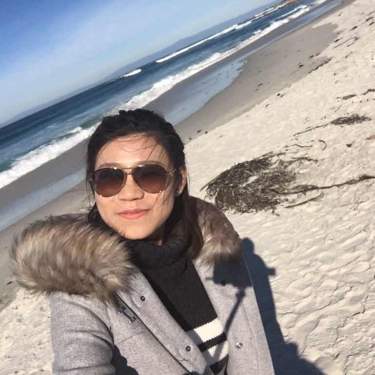

<!doctype html>
<html>
  <head>
    <meta charset="utf-8">
    <meta http-equiv="X-UA-Compatible" content="chrome=1">
    <title> Meet Jiewei Chen </title>
    <link rel="stylesheet" href="{{ '/assets/css/style.css?v=' | append: site.github.build_revision | relative_url }}">
    
    
    <!--[if lt IE 9]>
      
    <![endif]-->
    <!--[if lt IE 8]>
    <link rel="stylesheet" href="{{ '/assets/css/ie.css' | relative_url }}">
    <![endif]-->
    <meta name="viewport" content="width=device-width, initial-scale=1, user-scalable=no">

  </head>
  <body>

    

      <section>
        

          <h1> Welcome to Jiewei's Site</h1>
          

          
 Ph.D, Data Enthusiast, Materials Scientist 

          

          Project maintained by Jiewei 
          Hosted on GitHub Pages &mdash; Theme by <a href="https://twitter.com/michigangraham">mattgraham</a>
        

	
<ul>
  <li> <h2> Who am I ? </h2>
  

  Hi, I am Jiewei! Welcome to my website.

  

  	
  

  
 
  I am from Wuhan, China, a place along the Yangtze river, a place full of great food and a place where Yellow Crane Tower locates. In 2010, I left my hometown and entered Zhejiang University in Hang Zhou. I spent my most beautiful four years in this "Paradise City". Not to exaggerate, Hangzhou can be called my second hometown. I missed it! After the graduation from ZJU in 2014, I headed University of California, Davis to get my Ph.D degree. That is where I am now. =] 
  

  
 I love badminton, love singing, love life! 
    Please check out my <a href="https://www.youtube.com/channel/UCpHNNykAjvIkK7frlnXvnVQ">youtube channel</a>, where I record my life!  😝 

  

  <li> <h2> Education </h2>  
       <ul> 
            <li> <b> Graduate Study</b> 
                  <ul> 
                  <li> University of Californiam Davis, CA </li>
                  <li> Ph.D in <a href="https://mse.engineering.ucdavis.edu/">Materials Science and Engineering </a></li>  
                  <li> Master in <a href="http://www.stat.ucdavis.edu/"> Statistics </a></li>
                  </ul>
            </li> 
            <li> <b> Undergraduate Study </b> 
                  <ul>
                  <li> <a href="http://ckc.zju.edu.cn/english/">Chu Kochen Honor College</a>, <a href="http://www.zju.edu.cn/english/">Zhejiang University</a>, Hangzhou, China </li>
                  <li>B.S in <a href="http://polymer.zju.edu.cn/english/">Polymer Materials and Engineering</a> </li>
                  </ul>
            </li>
       </ul>
   </li> 

  <li> <h2> Projects </h2>
       <ul> 
       	    <li> <h3> Statistics </h3>
	    	<ol>
		    <li> <a href ="JobMarket/jobmarket.html" >Recent Job Market Analysis across Differnet Majors</a> </li>
		    <li> Analysis of Annual Energy Consumption of UC Davis Campus </li>
		</ol>
	    </li>
	    
            <li> <h3> Materials Science </h3>
	    	<ol>
			<li> Structure and Energetics of SiOC and SiOC-modifiedcarbon-bonded Carbon Fiber Composites </li>
			<li> Thermodynamic Stability of Low-k SiOCH Dielectric Films </li>
			<li> Thermodynamic Stability of Metal-substituted LiMn2-xMxO4 (M = Cr, Fe, Co and Ni) </li>
			<li> The Synthesis and Electric Applications of Graphene Nanoscrolls </li>
			<li> Graphene-based Stretchable, Transparent Conductor </li>		
		</ol>
	    </li>
        </ul>
  </li> 
  

